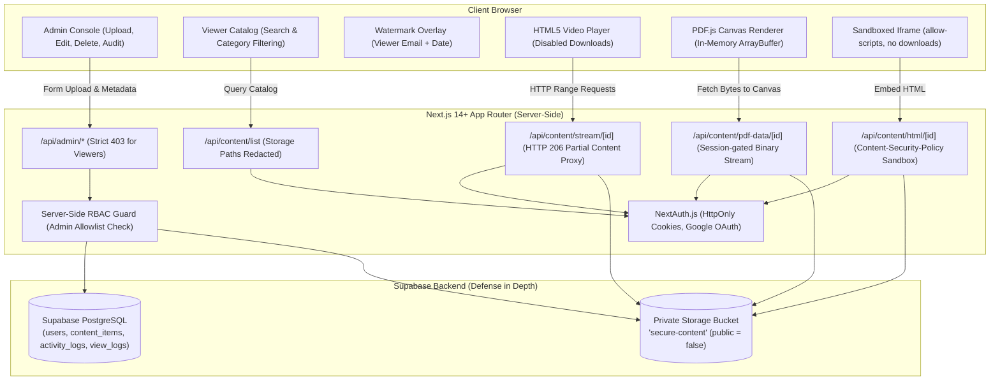

# Secure Content Portal

[](https://www.typescriptlang.org/)
[](https://nextjs.org/)
[](https://next-auth.js.org/)
[](https://supabase.com/)
[](https://tailwindcss.com/)

A portfolio-grade, production-style enterprise web application designed for distributing protected training videos, confidential PDF manuals, and interactive HTML modules with **zero raw-file exposure**.

Built with a strict zero-trust posture: Viewers consume content rendered completely in-memory or through token-gated byte streams, without any working path to download or save original binary assets.

---

## Architecture Overview



---

## Security Trade-offs & Architecture Decisions

This application distinguishes strictly between **true cryptographic/server security boundaries** and **client-side cosmetic deterrents**.

### 1. True Security Boundaries (Server-Enforced)

| Security Mechanism | Implementation | Threat Mitigated |
| :--- | :--- | :--- |
| **Server-Side Role Authorization** | Every `/api/admin/*` route re-verifies the caller's JWT/session via `requireAdminSession()`. If the caller has `role === 'viewer'`, the server terminates the request with `HTTP 403 Forbidden`. | Client impersonation, developer tools tampering, direct API calls (e.g. `curl`). |
| **Private Supabase Storage Bucket** | The storage bucket (`secure-content`) is created with `public = false`. Direct bucket URLs return `403/404`. | Public URL enumeration, search engine scraping, unauthorized file hotlinking. |
| **Non-Guessable Storage Keys** | Files are stored under `${contentType}/${crypto.randomUUID()}.${ext}`. | Predictable file crawling (e.g. `/uploads/file1.mp4`). |
| **Storage Path Redaction** | `/api/content/list` strips `storage_path` from records returned to Viewers. | Exposing underlying infrastructure details to viewers. |
| **Token-Gated Range Video Proxy** | `/api/content/stream/[id]` parses `Range: bytes=start-end`, checks user session per chunk, and returns `206 Partial Content`. | Video file piracy via raw URLs while preserving smooth player seeking. |
| **In-Memory Canvas PDF Rendering** | PDF binaries are loaded into an in-memory `ArrayBuffer` via authenticated stream and rendered to `<canvas>` via `pdfjs-dist`. | Default browser PDF plugins providing native "Save As" / "Download" buttons. |
| **Sandboxed HTML Execution** | Served via `<iframe sandbox="allow-scripts">` without `allow-downloads` or `allow-top-navigation` and protected by strict `Content-Security-Policy`. | Script-based downloads, parent frame navigation, malicious cookie extraction. |
| **Upload Whitelisting & Size Caps** | File extension, MIME type, and size caps (200MB video, 20MB PDF/HTML) enforced server-side. | Remote code execution, server disk exhaustion, MIME spoofing. |

### 2. Cosmetic Deterrents (Client-Side Enhancements)

> [!NOTE]
> As documented per requirements, these deterrents raise the barrier to casual copying, but are **not** considered airtight cryptographic security boundaries:
- **Right-Click Context Menu Prevention**: `onContextMenu={(e) => e.preventDefault()}` on all media viewers to deter casual "Save Image As" / "Save Video As".
- **CSS `user-select: none`**: Prevents casual text highlighting and copying.
- **Dynamic Watermark Overlay**: Renders the viewer's authenticated email and access date diagonally across the canvas/video viewport. This acts as a deterrent against taking phone photos or screen captures, establishing accountability.

### 3. Production Roadmap: What We Would Add With More Time
1. **DRM & Encrypted Media Extensions (EME)**: Encode video into FairPlay/Widevine encrypted HLS/DASH fragments (`.m3u8` / `.mpd`) where decryption keys are served via session-bound licensing servers.
2. **Dynamic Forensic Steganography**: Embed imperceptible high-frequency watermarking in video and audio streams to trace screen-recorded leaks back to specific user accounts.
3. **Session-Bound Ephemeral Stream Tokens**: Issue single-use, 30-second HMAC tokens tied to the viewer's IP/User-Agent for each media chunk request.
4. **Rate Limiting & Anomaly Detection**: Implement token-bucket rate limiting via Upstash Redis to prevent bulk extraction scraping.

---

## Tech Stack & Rationale

- **Framework**: Next.js 14+ (App Router) — Unified full-stack TypeScript architecture with server components, route handlers, and streaming.
- **Authentication**: NextAuth.js (Auth.js) — Secure HttpOnly cookie sessions, Google OAuth provider, and admin email allowlist elevation.
- **Database**: Supabase PostgreSQL — Relational data model with RLS policies and index optimization.
- **Storage**: Supabase Storage (Private Bucket) — Server-mediated uploads and signed URL generation.
- **PDF Engine**: `pdfjs-dist` — Client-side in-memory canvas rendering.
- **Styling**: Tailwind CSS & Lucide Icons — Sleek dark enterprise UI.
- **Testing**: `tsx` automated test runner asserting RBAC boundaries.

---

## Data Model

```sql
-- Users (Elevated to 'admin' if email is in ADMIN_EMAILS allowlist)
CREATE TABLE users (
  id UUID PRIMARY KEY DEFAULT gen_random_uuid(),
  email TEXT UNIQUE NOT NULL,
  name TEXT,
  avatar_url TEXT,
  role TEXT NOT NULL DEFAULT 'viewer' CHECK (role IN ('admin', 'viewer')),
  created_at TIMESTAMPTZ DEFAULT now(),
  updated_at TIMESTAMPTZ DEFAULT now()
);

-- Content Items (Private storage_path never exposed to viewers)
CREATE TABLE content_items (
  id UUID PRIMARY KEY DEFAULT gen_random_uuid(),
  title TEXT NOT NULL,
  description TEXT,
  category TEXT NOT NULL DEFAULT 'General',
  content_type TEXT NOT NULL CHECK (content_type IN ('video', 'pdf', 'html')),
  storage_path TEXT NOT NULL,
  file_size BIGINT,
  mime_type TEXT,
  uploaded_by UUID REFERENCES users(id) ON DELETE SET NULL,
  created_at TIMESTAMPTZ DEFAULT now(),
  updated_at TIMESTAMPTZ DEFAULT now()
);

-- Activity Logs (Audit trail for upload, edit, delete actions)
CREATE TABLE activity_logs (
  id UUID PRIMARY KEY DEFAULT gen_random_uuid(),
  admin_id UUID REFERENCES users(id) ON DELETE SET NULL,
  admin_email TEXT NOT NULL,
  action TEXT NOT NULL CHECK (action IN ('upload', 'edit', 'delete')),
  content_item_id UUID,
  content_title TEXT NOT NULL,
  details JSONB DEFAULT '{}'::jsonb,
  timestamp TIMESTAMPTZ DEFAULT now()
);

-- View Logs (Per-item view counts and viewer audit history)
CREATE TABLE view_logs (
  id UUID PRIMARY KEY DEFAULT gen_random_uuid(),
  content_item_id UUID NOT NULL REFERENCES content_items(id) ON DELETE CASCADE,
  viewer_id UUID REFERENCES users(id) ON DELETE SET NULL,
  viewer_email TEXT NOT NULL,
  viewed_at TIMESTAMPTZ DEFAULT now()
);
```

---

## Local Development & Setup

### Prerequisites
- Node.js 18+ (tested on Node v20/v24 LTS)
- npm or pnpm

### 1. Clone & Install
```bash
git clone <repo-url>
cd secure-content-portal
npm install
```

### 2. Configure Environment Variables
Copy `.env.example` to `.env.local`:
```bash
cp .env.example .env.local
```

Populate the variables:
```env
NEXTAUTH_URL=http://localhost:3000
NEXTAUTH_SECRET=generate_with_openssl_rand_base64_32
GOOGLE_CLIENT_ID=your-google-oauth-client-id
GOOGLE_CLIENT_SECRET=your-google-oauth-client-secret
ADMIN_EMAILS=admin@example.com,your-email@org.com
NEXT_PUBLIC_SUPABASE_URL=https://your-project.supabase.co
NEXT_PUBLIC_SUPABASE_ANON_KEY=your-supabase-anon-key
SUPABASE_SERVICE_ROLE_KEY=your-supabase-service-role-key
SUPABASE_STORAGE_BUCKET=secure-content
NEXT_PUBLIC_ENABLE_DEV_AUTH=true
```

> **Reviewer Fast-Start Note**: With `NEXT_PUBLIC_ENABLE_DEV_AUTH=true`, reviewers can immediately log in as **Jane Admin** or **Alex Viewer** using the one-click persona switcher on `/login` to test the exact production role check, cookies, and UI flows without needing external Google Cloud API credentials configured upfront.

### 3. Run Automated RBAC Test Suite
```bash
npm test
```
Runs 23 automated assertions verifying 403 Forbidden enforcement on Viewer sessions, 401 on unauthenticated calls, file upload size/extension validation, storage path privacy, and audit logging.

### 4. Run Development Server
```bash
npm run dev
# or build & start production server
npm run build
npm start
```
Visit `http://localhost:3000` in your browser.

---

## Vercel & Supabase Deployment Guide

### Step 1: Set up Supabase
1. Create a free project at [supabase.com](https://supabase.com).
2. Open the **SQL Editor** in Supabase and paste the entire contents of [`supabase/schema.sql`](./supabase/schema.sql). Click **Run**.
   - This creates the `users`, `content_items`, `activity_logs`, and `view_logs` tables.
   - This automatically creates the private `secure-content` bucket with `public = false`.
3. Go to **Project Settings -> API** to copy:
   - Project URL (`NEXT_PUBLIC_SUPABASE_URL`)
   - Project Anon Key (`NEXT_PUBLIC_SUPABASE_ANON_KEY`)
   - Service Role Secret Key (`SUPABASE_SERVICE_ROLE_KEY`)

### Step 2: Set up Google OAuth
1. Go to [Google Cloud Console](https://console.cloud.google.com/) -> **APIs & Services** -> **Credentials**.
2. Create an **OAuth 2.0 Client ID** (Web application).
3. Under **Authorized Redirect URIs**, add:
   - Local: `http://localhost:3000/api/auth/callback/google`
   - Production: `https://<your-vercel-app>.vercel.app/api/auth/callback/google`

### Step 3: Deploy to Vercel
1. Import your GitHub repository to [vercel.com](https://vercel.com).
2. Under **Environment Variables**, add:
   - `NEXTAUTH_URL`: `https://<your-vercel-app>.vercel.app`
   - `NEXTAUTH_SECRET`: `<random-32-byte-secret>`
   - `GOOGLE_CLIENT_ID`: `<google-client-id>`
   - `GOOGLE_CLIENT_SECRET`: `<google-client-secret>`
   - `ADMIN_EMAILS`: `<your-google-email>,admin@example.com`
   - `NEXT_PUBLIC_SUPABASE_URL`: `<supabase-url>`
   - `NEXT_PUBLIC_SUPABASE_ANON_KEY`: `<supabase-anon-key>`
   - `SUPABASE_SERVICE_ROLE_KEY`: `<supabase-service-role-key>`
   - `SUPABASE_STORAGE_BUCKET`: `secure-content`
3. Click **Deploy**. Vercel will build the Next.js app and deploy it on global edge infrastructure.

---

## Known Assumptions

1. **Admin Elevation Mechanism**: Seeded via the `ADMIN_EMAILS` environment variable allowlist checked upon sign-in, per project specifications (no admin invite UI required).
2. **Local Fallback Mode**: When running locally without live cloud keys, an in-memory repository seamlessly provides sample video, PDF, and HTML assets so that reviewers can verify the entire workflow immediately.
3. **HTTP Range Chunking**: Chunk size is set to 1MB per range request response to ensure low latency and responsive seeking across arbitrary video offsets.
